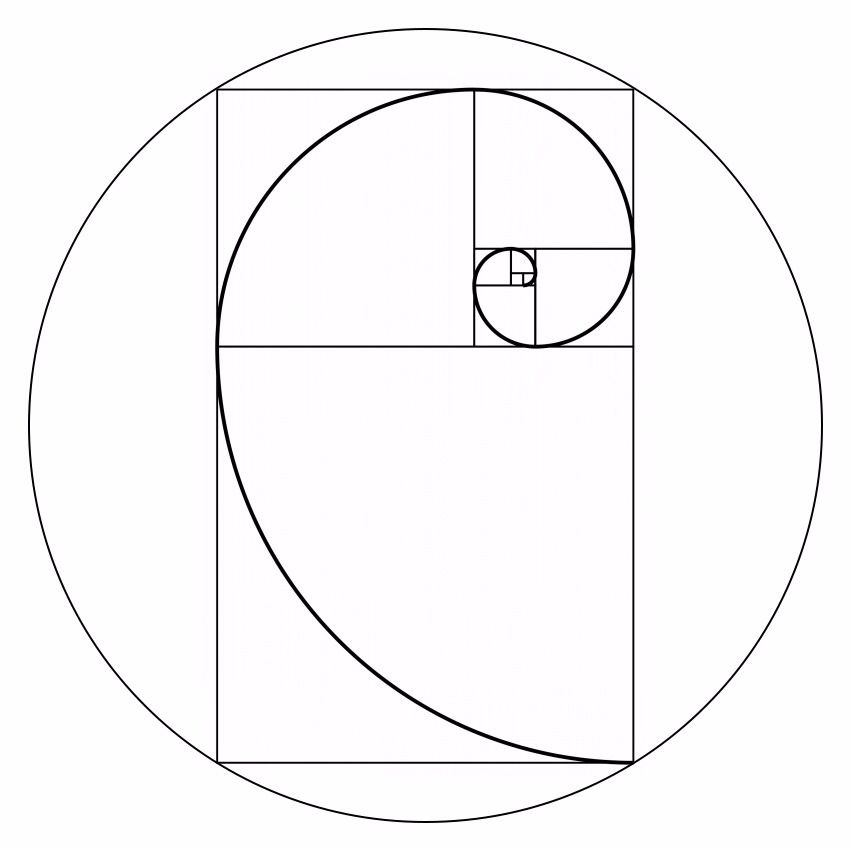

# Fibonacci

> The Fibonacci sequence is defined as the sum of the last two numbers to a respective digit, from this, this program was created that seeks to calculate the Fibonacci of the number said by the user.
